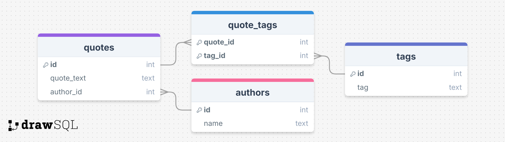

# Web Scraping and Database Storage

## Description

This project performs scraping of quotes from the website [Quotes to Scrape](https://quotes.toscrape.com) and stores the extracted information in a SQLite database. The script navigates through all pages of the site, extracts quotes, authors, and tags, and saves this data in a relational database with the corresponding tables.

## Project Files

- **main.py**: Main file that coordinates the complete process flow. It checks if the database exists, and if not, creates it. Then, it performs the scraping of quotes and stores the data in the database.

- **create_db.py**: Script that defines and creates the database structure (tables for authors, quotes, tags, and relationships between them).

- **db.py**: Contains the necessary functions to interact with the database, including creating the connection, inserting authors, quotes, tags, and associating quotes with tags.

- **scraper.py**: Responsible for performing the web scraping. It navigates through all available pages, extracts the necessary information (quotes, authors, tags), and organizes it for storage. Includes handling of common HTTP errors and avoids overloading the server through random pauses between requests.

- **get_quotes.py**: Script to query and display quotes from a specific author from the database. It prompts the user for the author's name (with the option to use a default value) and displays all quotes associated with that author.

## Database Schema



## Requirements

- Python 3.11+

## Execution Instructions

1. **Set up virtual environment**:

   - On macOS/Linux:
     ```bash
     python3 -m venv venv
     source venv/bin/activate
     ```
   - On Windows:
     ```bash
     python -m venv venv
     .\venv\Scripts\activate
     ```

2. **Install dependencies**:

   ```bash
   pip install -r requirements.txt
   ```

3. **Run scraping**:

   ```bash
   cd src
   python main.py
   ```

4. **Get quotes by author**:

   ```bash
   python get_quotes.py
   ```

5. **Deactivate virtual environment** (optional):
   ```bash
   deactivate
   ```

## Author

[Juan De Luca](https://github.com/delucajuan/)
